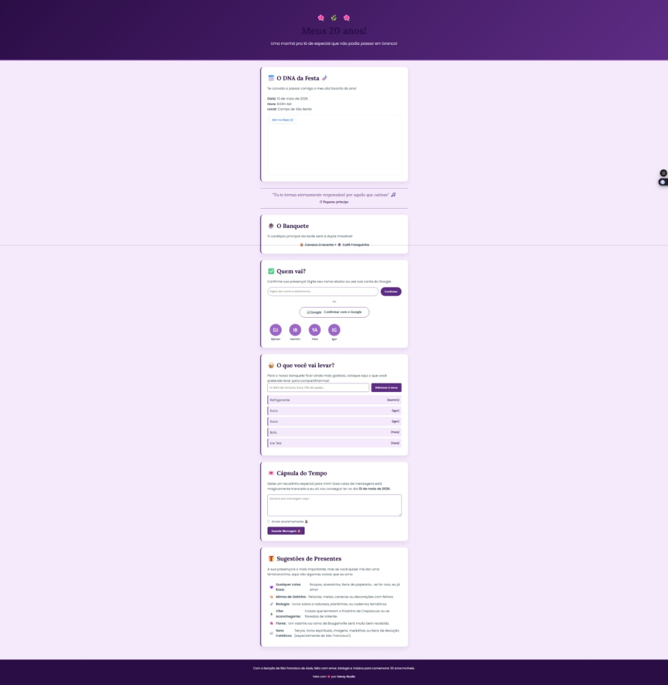

<div align="center">

# 💌 Convite Digital Interativo & Gestão de Eventos 💚

<p align="center">
  
</p>

[](https://developer.mozilla.org)
[](https://developer.mozilla.org)
[](https://developer.mozilla.org)
[](https://firebase.google.com/)

<p align="center">
  <b>💚 Convite digital interativo com confirmação de presença (RSVP) em tempo real e painel administrativo.</b>
</p>

</div>

---

## 📌 Visão Geral

Um convite digital interativo, imersivo e personalizado para eventos especiais. O projeto une design acolhedor e responsivo a um sistema completo de RSVP (confirmação de presença), mesa colaborativa de itens, cápsula do tempo secreta e painel de controle administrativo para o anfitrião gerenciar tudo em tempo real.

---

## 📸 Demonstração das Telas

<div align="center">

### 👥 Visão do Anfitrião (Painel Administrativo)

| Painel & Editor CMS | Lista de Presenças Confirmadas |
| :---: | :---: |
|  |  |

| Mesa Colaborativa de Itens | Cápsula do Tempo (Bloqueada por Data) |
| :---: | :---: |
|  |  |

</div>

---

## ✨ Funcionalidades Principais

### 🏠 Visão dos Convidados (`index.html`)
- **📍 Informações em Tempo Real**: Data, hora, endereço e mapa dinâmico integrado via Google Maps.
- **✅ RSVP Flexível**: Confirmação de presença com autenticação via conta Google ou preenchimento de nome com avatar gerado automaticamente.
- **🧺 Mesa Colaborativa**: Lista interativa onde convidados adicionam o que levarão para a celebração.
- **💌 Cápsula do Tempo**: Mensagens carinhosas enviadas pelos convidados que ficam trancadas até o dia exato do evento.
- **🎁 Guia de Presentes**: Seção visual com ideias e preferências.

### 🛠️ Painel do Anfitrião (`admin.html`)
- **🔐 Acesso Protegido**: Validação com código de segurança / enigma temático.
- **📝 Editor CMS Sem Código**: Modificação instantânea de textos, datas e links sem alterar o código-fonte.
- **👥 Controle de RSVP**: Visualização consolidada de convidados com opção de gestão e remoção.
- **📋 Gestão de Alimentos e Bebidas**: Controle de itens cadastrados pelos convidados.
- **⌛ Destrancamento da Cápsula**: Leitura das mensagens no dia do evento.

---

## 📂 Arquitetura de Pastas

```text
venoyInvite/
├── preview/                     # Capturas de tela da interface
│   ├── admin-convidados.png     # Gestão de presença
│   ├── admin-inicial.png        # CMS e configurações
│   ├── admin-lista.png          # Controle de itens da mesa
│   ├── admin-mensagem.png       # Cápsula do tempo
│   └── inicial.jpg              # Hero e tela principal
├── admin.html                   # Painel administrativo do anfitrião
├── index.html                   # Interface pública do convite interativo
├── .gitattributes               # Configurações do Git
└── README.md                    # Documentação do projeto
```

---

## 🔑 Configuração do Firebase

1. Acesse o [Firebase Console](https://console.firebase.google.com/) e crie um novo projeto.
2. Ative o **Firestore Database** (em modo de teste ou com regras seguras) e o **Authentication** (habilite o provedor Google).
3. Em *Configurações do Projeto > Geral > Seus Aplicativos*, selecione Web (`</>`) e copie o objeto de configuração:

```javascript
const firebaseConfig = {
  apiKey: "SUA_API_KEY",
  authDomain: "SEU_DOMINIO.firebaseapp.com",
  projectId: "SEU_PROJECT_ID",
  storageBucket: "SEU_BUCKET.appspot.com",
  messagingSenderId: "SEU_SENDER_ID",
  appId: "SEU_APP_ID"
};
```

4. Cole a configuração na constante correspondente nos arquivos `index.html` e `admin.html`.

---

<div align="center">
  <sub>Desenvolvido com 💚 por <b>Paulo Venoy</b> • Venoy Studio</sub>
</div>